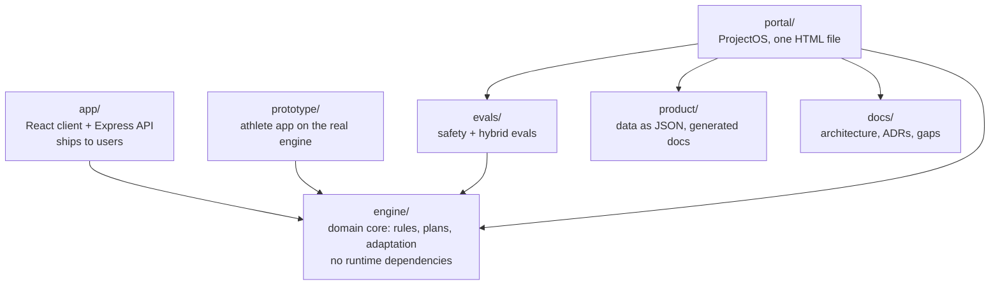

# PolySync repository architecture

This repo holds one product: **PolySync**, AI coaching for hybrid athletes, where a deterministic engine prescribes, a model explains and proposes, and a coach handles what neither can resolve ([ADR-004](docs/10-decision-log.md)).

This page covers **where code lives and what may depend on what**. The runtime (API, data, model calls) is in [docs/01-system-architecture.md](docs/01-system-architecture.md). The boundaries below are checked on every push by [`scripts/check-boundaries.mjs`](scripts/check-boundaries.mjs) ([ADR-012](docs/10-decision-log.md#adr-012-one-product-per-repo-the-engine-is-its-own-package)).

## The shape

Arrows point from the importer to what it imports. Nothing imports `app/`, `prototype/` or `portal/`: they are leaves. The engine imports nothing outside itself.

## Areas

| Path | Role | May import | Deploys to | CI |
|---|---|---|---|---|
| [`engine/`](engine/) | Deterministic domain core: weekly plans, hybrid rules H1–H9, bounds B1–B9, contraindications, daily adaptation, exercise library, body-load display model | Nothing outside `engine/`; no runtime npm dependencies | Compiled into `app/`, `prototype/` and `portal/` | `engine`: strict typecheck (0 errors), unit tests, evals |
| [`app/`](app/) | Runtime: React client, Express API (`server.ts`, `server/`), Firebase Auth + Firestore, Gemini | `engine/` | Not deployed yet | `app`: type-error ratchet, tests, build, bundle and boot checks, audit |
| [`evals/`](evals/) | Eval runners and committed results; the numbers the README and ProjectOS quote | `engine/` | — | `engine`: evals must pass and match committed results |
| [`prototype/`](prototype/) | High-fidelity athlete app on the production engine and the PolySync design tokens | `engine/` | GitHub Pages `/prototype/` | `prototype`: tests, build, end-to-end accessibility run |
| [`product/`](product/) | Strategy, evidence, model, risks, roadmap, validation as data; `build.mjs` validates and generates the Markdown | Nothing outside `product/` | — | `docs`: `build.mjs --check` |
| [`portal/`](portal/) | ProjectOS: reads product data, eval results and docs at build time; runs the engine in the browser | `engine/`, `product/`, `evals/`, `docs/` | GitHub Pages `/` | `portal`: build, no third-party scripts |
| [`docs/`](docs/) | Design authority: architecture, ADRs, gaps, UX review | — | — | `docs`: links, Mermaid, status lines |
| [`scripts/`](scripts/) | Repo-wide gates | — | — | `boundaries` |

## Rules

1. **The engine depends on nothing.** Pure TypeScript, no I/O, no model calls, no npm runtime dependencies. Anything that prescribes load lives here, and only here.
2. **Every consumer calls the same engine.** The app, the prototype, the evals and ProjectOS compile the same files, so a demo can't drift from what CI tests.
3. **Leaves stay leaves.** Nothing imports `app/`, `prototype/` or `portal/`. Shared code moves into `engine/` (the body model moved there from `portal/` for this reason).
4. **Data before prose.** Product numbers live in `product/data/*.json`; the Markdown is generated and CI fails when it is stale.
5. **One product per repo.** PolyVerses (the agentic PM workbench this runtime was first built in) and Product Leadership OS (PLOS, the skills library) live in their own repositories. The gate fails on their names, their agents, skills or prompt folders, or their orchestration components.

## Where new work goes

| Change | Goes in | Also update |
|---|---|---|
| A training rule or parameter | `engine/` | A unit test in `engine/__tests__/`, an eval case in `evals/`, [doc 12](docs/12-hybrid-athlete-programming-engine.md) |
| An API route | `app/server.ts` or `app/server/` | Input validation and a test in `app/server/` |
| A screen, before it ships | `prototype/` | The end-to-end run in `prototype/e2e/` |
| A market or science claim | `product/data/evidence.json` | Grade it; D-grade claims cannot feed the model |
| A decision | [`docs/10-decision-log.md`](docs/10-decision-log.md) | What was rejected and what would reverse it |
| A known weakness | [`docs/GAPS.md`](docs/GAPS.md) | Rank it by credibility risk |

## Known exceptions

- `app/firebase-applet-config.json` names a Firestore database created before the repo split. Renaming it means migrating data, so it stays; the gate allows that file (ADR-012).
- `docs/13-ux-review.md` records the removal of the leftover components, so it names them; the gate allows that file.

## Next structural steps (not done)

| Step | Why | Blocked by |
|---|---|---|
| Give the engine one public entry point (`engine/index.ts`) and import only from it | Consumers import individual files today; a single surface makes breaking changes visible | Nothing; small refactor |
| Split `app/server.ts` (about 2,300 lines) into route modules under `app/server/` | Routes, auth and model calls share one file | GAPS #12 first (server data access), so the split happens once |
| Coach console as its own client in `app/` | The buyer's value (ADR-009); no coach screen exists | Coach screens not designed yet (roadmap: coach console) |
