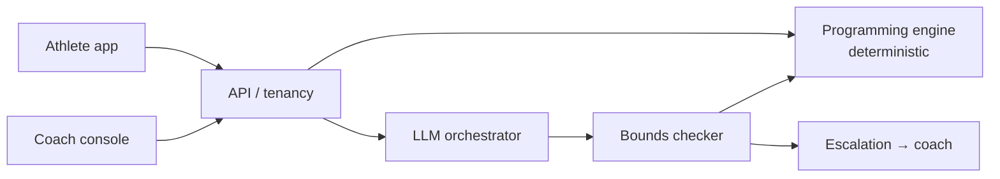

# PolySync

**AI coaching for hybrid athletes.** B2B2C, with a human coach in the loop.

Hybrid athletes chase endurance and strength adaptations at the same time. Those adaptations interfere with each other, and mainstream apps don't resolve it — they run two plans in parallel and let the athlete absorb the collision. PolySync makes that trade-off explicitly, every week, and shows its work.

## The load-bearing decision

The **deterministic programming engine** owns every load prescription. The LLM explains, converses, and *proposes* adaptations as structured deltas — every one of which must clear a bounds checker before it reaches an athlete. Anything outside safe bounds goes to a named human coach as a draft.

Four consequences:
- Safety is auditable to an org buyer's risk function.
- Prompt injection cannot change training load.
- A model provider outage degrades the explanation, not the training.
- Eval gates are meaningful, because prescription is reproducible.

## Architecture

## Documentation

Full set in [`docs/`](docs/) — architecture, data model, AI architecture, RAG grounding, evaluation harness, decision log, unit economics, and the hybrid programming engine.

Start with:
- [Decision log](docs/10-decision-log.md) — the four calls that shaped the product, with rejected options and reversal triggers
- [Evaluation and evidence](docs/07-evaluation-and-evidence.md) — eval sets, CI gates, and an explicit account of what the evals do *not* prove
- [Hybrid programming engine](docs/12-hybrid-athlete-programming-engine.md) — the domain logic
- [Gaps](docs/GAPS.md) — what's unresolved, ranked

## Status

Active build. Documentation status is marked per section: `AUTHORED`, `PROPOSED`, or `TBD`. No metric in this repo is estimated — unmeasured values are marked `TBD` rather than filled with plausible numbers.

---
Ossama Mokhtar · Dubai, UAE
