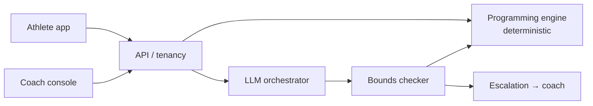

# PolySync

**AI coaching for hybrid athletes.** B2B2C, with a human coach in the loop.

Hybrid athletes chase endurance and strength adaptations at the same time. Those adaptations interfere with each other, and mainstream apps don't resolve it — they run two plans in parallel and let the athlete or coach arbitrate. PolySync treats training as a control problem, not a chat problem.

## The load-bearing decision

The **deterministic programming engine** owns every load prescription. The LLM explains, converses, and *proposes* adaptations as structured deltas — every one of which must clear a bounds checker before it can produce athlete-facing output.

Four consequences:
- Safety is auditable to an org buyer's risk function.
- Prompt injection cannot change training load.
- A model provider outage degrades the explanation, not the training.
- Eval gates are meaningful, because prescription is reproducible.

## Architecture

Also see the full diagram: [`docs/architecture-diagram.png`](docs/architecture-diagram.png) — container view with clients, platform, data, and eval harness.

## Product status (honest)

PolySync's **documentation in this repo is the design authority**. The product is designed with strong rationale but not yet proven with measured results:

| Layer | Status |
|---|---|
| Decision log (5 ADRs, reversal triggers, beachhead named) | **Authored** |
| System architecture, data model, AI architecture, RAG design | **Authored** |
| Hybrid programming engine (the actual domain logic) | **Authored** |
| Eval harness (5 sets designed, gates proposed) | **Designed — no results yet** |
| Coach minutes / athlete-month (unit economics) | **Designed — not measured** |
| Protocol library (the moat) | **Designed — not coach-signed** |
| Live deployment | **Not deployed** — code on a branch, not a runnable service in this repo |

This is not a contradiction to resolve by drift. A reviewer evaluating **product thinking** should evaluate the docs. A reviewer evaluating **deployability** should note the code is not yet unified. See [`docs/00-unified-product-status.md`](docs/00-unified-product-status.md) for the full account.

## Documentation

Full set in [`docs/`](docs/) — 17 documents covering architecture, data model, AI architecture, RAG grounding, evaluation harness, decision log, unit economics, security, and the hybrid programming engine.

Start with:
- [Unified product status](docs/00-unified-product-status.md) — where the product lives, what is real vs designed vs TBD
- [Decision log](docs/10-decision-log.md) — 5 ADRs with rejected options and reversal triggers; beachhead named in ADR-005
- [Evaluation and evidence](docs/07-evaluation-and-evidence.md) — eval sets, CI gates, and an explicit account of what the evals do *not* prove
- [Gaps](docs/GAPS.md) — what's unresolved, ranked by damage-if-unfilled
- [Hybrid programming engine](docs/12-hybrid-athlete-programming-engine.md) — the domain logic

## Evaluation status

PolySync has **designed** an eval harness with 5 sets and proposed gates, but has **zero results**:

| Eval set | n (target) | Status |
|---|---|---|
| Golden programming | 150 athlete-weeks | Designed — not run |
| Safety adversarial | 120 | Designed — not run |
| Contraindication | 80 | Designed — not run |
| Prompt injection | 60 | Designed — not run |
| Regression | Grows with incidents | Designed — not run |

CI gates are proposed, not yet wired. The single most important next step is running the first eval set. See [GAPS #1](docs/GAPS.md).

## Beachhead

**Named:** US-based boutique endurance + strength hybrid athletics gyms and coach-staffed hybrid training programs. Single sport context: concurrent endurance + resistance training. Single coach archetype: certified S&C coach managing 20–60 hybrid athletes. Legal regime: US state-level privacy law.

See [ADR-005](docs/10-decision-log.md) for the full decision and reversal trigger.

## Repository status

- **This repo** (`github.com/OssamaMokhtar/PolySync`) — canonical source of truth for design and docs
- **Code** — on a PolyVerses branch; not yet a runnable service in this repo (being consolidated separately)
- **Design artifacts** — in Claude Design / designer of record

CI: [`github.com/OssamaMokhtar/PolySync/actions`](https://github.com/OssamaMokhtar/PolySync/actions) — typecheck and audit workflows present.

## Gaps (ranked)

See [`docs/GAPS.md`](docs/GAPS.md) for the full list. Top 3 by fill-order:
1. **No eval results** — every gate is PROPOSED (Severe)
2. **Coach minutes / athlete-month unknown** (Severe)
3. **Beachhead now named in ADR-005** (was High, now resolved)

## Contributing

See [`CONTRIBUTING.md`](CONTRIBUTING.md).

---

Ossama Mokhtar · Dubai, UAE
