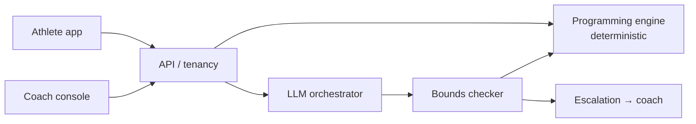

# PolySync

**AI coaching for hybrid athletes.** B2B2C, with a human coach in the loop.

Hybrid athletes chase endurance and strength adaptations at the same time. Those adaptations interfere with each other, and mainstream apps don't resolve it — they run two plans in parallel and let the athlete or coach arbitrate. PolySync treats training as a control problem, not a chat problem.

## The load-bearing decision

The **deterministic programming engine** owns every load prescription. The LLM explains, converses, and *proposes* adaptations as structured deltas — every one of which must clear a bounds checker before it can produce athlete-facing output.

Four consequences:
- Safety is auditable to an org buyer's risk function.
- Prompt injection cannot change training load.
- A model provider outage degrades the explanation, not the training.
- Eval gates are meaningful, because prescription is reproducible.

## Architecture

Also see the full diagram: [`docs/architecture-diagram.png`](docs/architecture-diagram.png) — container view with clients, platform, data, and eval harness.

## Product status (honest)

| Layer | Status |
|---|---|
| Decision log (5 ADRs, reversal triggers, beachhead named) | **Authored** |
| Runtime code (React + Express + Firebase + Gemini) | **In this repo** under [`app/`](app/) since 23 Sep 2026, moved from PolyVerses with history |
| Deterministic engine + bounds checker (ADR-004) | **Built and enforced** in [`app/src/engine/`](app/src/engine/). Gemini output is a proposal that must pass rules B1–B9 |
| Safety-layer evals | **Run in CI**: 0 contraindication leaks in 8,640 engine plans; 2,067/2,067 unsafe proposals blocked and escalated ([results](evals/results/latest.json)) |
| Model-in-the-loop evals (golden programming, free-text safety, live injection) | **Designed, not run** |
| Coach minutes / athlete-month (unit economics) | **Not measured** |
| Protocol library and contraindication rules (the moat) | **v0, not coach-signed** |
| Live deployment | **Not deployed** |

See [`docs/00-unified-product-status.md`](docs/00-unified-product-status.md) for the full account.

## Documentation

Full set in [`docs/`](docs/) — 17 documents covering architecture, data model, AI architecture, RAG grounding, evaluation harness, decision log, unit economics, security, and the hybrid programming engine.

Start with:
- [Unified product status](docs/00-unified-product-status.md) — where the product lives, what is real vs designed vs TBD
- [Decision log](docs/10-decision-log.md) — 5 ADRs with rejected options and reversal triggers; beachhead named in ADR-005
- [Evaluation and evidence](docs/07-evaluation-and-evidence.md) — eval sets, CI gates, and an explicit account of what the evals do *not* prove
- [Gaps](docs/GAPS.md) — what's unresolved, ranked by damage-if-unfilled
- [Hybrid programming engine](docs/12-hybrid-athlete-programming-engine.md) — the domain logic

## Evaluation status

The safety layer is measured; the model is not. [`evals/run.ts`](evals/run.ts) runs on every push and fails the build on any breach:

| Set | n | Result |
|---|---|---|
| Rule table vs hand labels | 49 pairs | 49/49 agree |
| Contraindication leak (engine plans) | 8,640 | 0 |
| Unsafe proposals blocked (8 mutation types) | 2,067 | 2,067 |
| Blocked proposals escalated to coach | 2,067 | 2,067 |
| Safe proposals accepted | 194 | 194 |

These are deterministic checks of the code against its own v0 rules. They do not show the rules are clinically right (no coach review yet) or that model proposals are any good. The five model-in-the-loop sets in [doc 07](docs/07-evaluation-and-evidence.md) are still unrun.

## Beachhead

**Named:** US-based boutique endurance + strength hybrid athletics gyms and coach-staffed hybrid training programs. Single sport context: concurrent endurance + resistance training. Single coach archetype: certified S&C coach managing 20–60 hybrid athletes. Legal regime: US state-level privacy law.

See [ADR-005](docs/10-decision-log.md) for the full decision and reversal trigger.

## Repository layout

| Path | What |
|---|---|
| `docs/` | Design authority: architecture, ADRs, evaluation, gaps |
| `app/` | Runtime code ([app/README.md](app/README.md)) |
| `evals/` | Safety-layer eval runner, hand labels, results |
| Design screens | Claude Design; not yet exported here (GAPS #8) |

CI: [`.github/workflows/ci.yml`](.github/workflows/ci.yml) (engine strict typecheck, type-error ratchet, tests, evals, build, bundle check, audit) and [`docs.yml`](.github/workflows/docs.yml) (links, Mermaid, status headers).

## Gaps (ranked)

See [`docs/GAPS.md`](docs/GAPS.md). Top open items:
1. **No model-in-the-loop eval results** (Severe; narrowed now that the safety layer is measured)
2. **Coach minutes / athlete-month unknown** (Severe)
3. **Beachhead geography** (new #11): ADR-005 says US boutique gyms, while a Dubai-based UAE pilot is the practical first test. Decide before the DPIA.

## Contributing

See [`CONTRIBUTING.md`](CONTRIBUTING.md).

---

Ossama Mokhtar · Dubai, UAE
