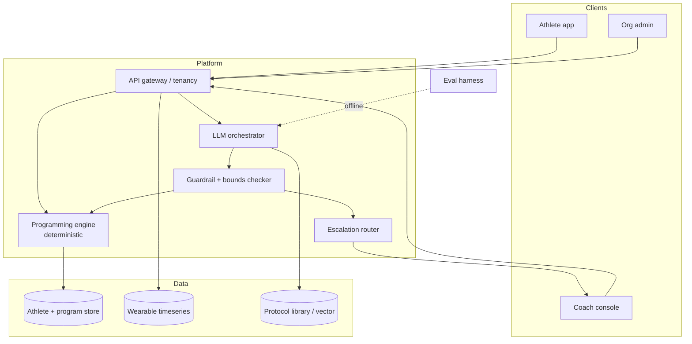

# PolySync — System Architecture

> Status: AUTHORED · Owner: Ossama Mokhtar

**Purpose.** The whole system in five minutes, and the one design decision everything else follows from.

## 1. Context

| Actor | Need | Interaction |
|---|---|---|
| Hybrid athlete | A plan that reconciles endurance and strength goals without stalling both | Mobile app, daily |
| Human coach | Leverage — supervise 40–80 athletes instead of 15 | Coach console, weekly + escalations |
| Org (gym, team, federation, corporate wellness) | Retention and outcomes across a roster; the paying customer | Admin dashboard, monthly |
| Wearable providers | — | Webhook / OAuth ingestion |

B2B2C: the org buys, the coach delivers, the athlete uses. Three retention curves, not one. See [ADR-001](10-decision-log.md).

## 2. Container view

## 3. The load-bearing decision

**The LLM never writes a load prescription. The deterministic programming engine does.**

The LLM: explains why a session changed, converses with the athlete, summarises a roster for the coach, and *proposes* adaptations as structured deltas. Every proposed delta passes the bounds checker before it reaches an athlete — and any delta outside safe bounds is routed to the coach as a draft, not applied.

Why this matters commercially: it makes the safety story auditable to an org buyer's risk function, and it caps the blast radius of a model regression at "wrong explanation" rather than "wrong load".

| # | Decision | Constraint it serves | Cost it accepts |
|---|---|---|---|
| 1 | Deterministic engine owns prescription | Auditability; B2B liability | Less "magical" adaptation; more engineering |
| 2 | Coach approval gate on out-of-bounds deltas | Human-in-loop is a product promise, not a fallback | Coach minutes become a unit cost — see [doc 11](11-metrics-and-unit-economics.md) |
| 3 | Protocol library as sole grounding corpus | Every recommendation cites a protocol ID | Cold-start effort building the library |
| 4 | Tenancy enforced at the gateway, not the query | Roster data cannot cross orgs | Slightly heavier request path |

## 4. Scale envelope

| Dimension | Today | Designed ceiling | First thing that breaks |
|---|---|---|---|
| Athletes / org | TBD | TBD | Coach console roster rendering |
| Athletes / coach | TBD | PROPOSED: 60 | Escalation queue depth exceeds coach weekly hours |
| Wearable samples/day | TBD | TBD | Timeseries write path |
| p95 plan-adaptation latency | TBD | PROPOSED: < 3 s perceived (async where not) | Orchestrator fan-out |
| Cost / athlete-month | TBD | See doc 11 | LLM conversation volume, not adaptation |
