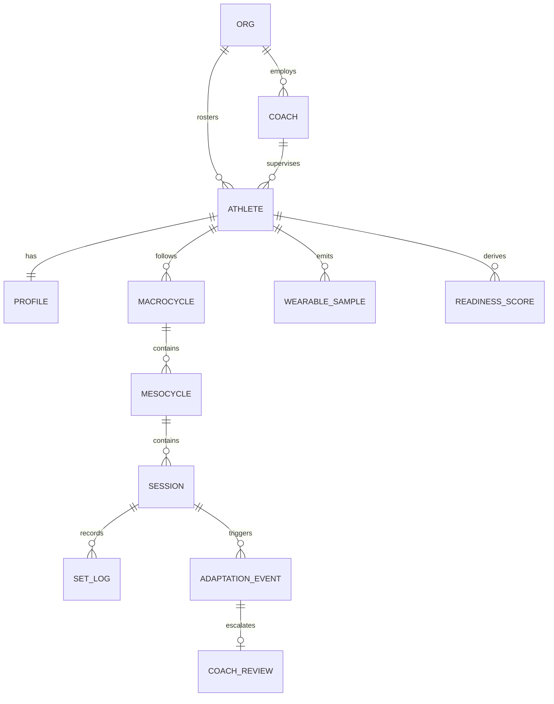

# PolySync — Data Model

> Status: AUTHORED (schema) · TBD (volumes) · Owner: Ossama Mokhtar

**Purpose.** Entities, and the health-data posture an org buyer's legal team will ask about in the first call.

## 1. ERD

## 2. Entities

| Entity | Key fields | Notes |
|---|---|---|
| `org` | tier, contract_terms, coach_seats | Tenancy root — every query scoped by this |
| `athlete` | org_id, coach_id, consent_state | `consent_state` is not a boolean; see §3 |
| `profile` | goals, training_age, injury_history, event_calendar | Injury history is special-category |
| `macrocycle` | target_event, phase_sequence | The hybrid reconciliation lives here |
| `mesocycle` | block_type, volume_target, intensity_distribution | See [doc 12](12-hybrid-athlete-programming-engine.md) |
| `session` | prescribed, delivered, rpe, completion_state | Prescribed vs delivered gap is the core signal |
| `wearable_sample` | source, metric, value, ts | High volume, low value individually |
| `readiness_score` | inputs[], score, confidence | Derived — never stored as ground truth |
| `adaptation_event` | proposer (engine\|llm), delta, bounds_result, applied | The audit trail |
| `coach_review` | event_id, action, note, latency | Feeds coach-minutes metric |

## 3. Classification and retention

Training, injury and biometric data on an identified person is **special-category health data** under GDPR Art. 9 and analogous UAE PDPL provisions. Consent must be explicit, purpose-scoped and withdrawable — and in B2B2C the athlete, not the org, is the data subject. An org cannot consent on a roster's behalf.

| Field group | Class | Retention | Basis |
|---|---|---|---|
| Identity | PII | Contract + 30 d | Contract |
| Training logs | Internal + linked-PII | TBD | Explicit consent |
| Injury history, biometrics, HRV | **Special category** | TBD — PROPOSED: 24 mo rolling | Explicit consent, withdrawable |
| Coach notes (free text) | Special category + injection surface | TBD | Explicit consent |
| Derived readiness | Internal | 90 d | Legitimate interest |

**Open question you must answer before an enterprise deal:** on athlete offboarding from an org, does the athlete's history follow them or stay with the org? Both answers are defensible; only one is in your contract. This is a commercial decision disguised as a schema decision.

## 4. Lineage

Captured: set logs, RPE, wearable samples, coach notes. Derived: readiness, ACWR, adaptation deltas, phase recommendations. Every derived field stores its input set — a coach who cannot see why readiness dropped will not trust the system twice.
