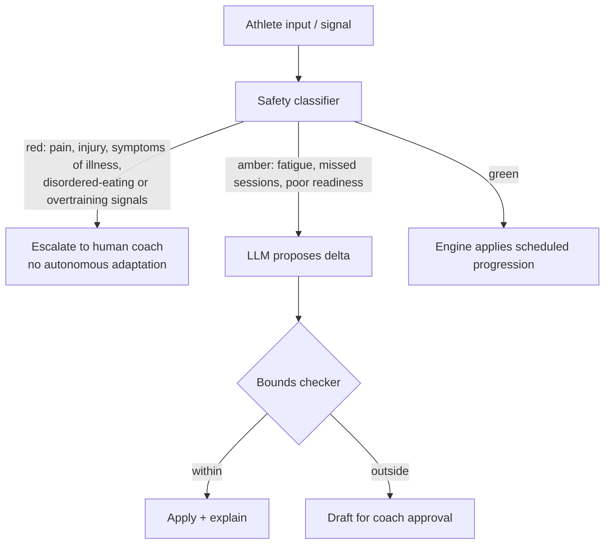

# PolySync — AI Architecture

> Status: PROPOSED (model choices) · TBD (all measured values) · Owner: Ossama Mokhtar

**Purpose.** What each model is for, how requests are routed by risk, and the guardrail chain no output bypasses.

## 1. Model portfolio

| Task | Class | Why | Fallback | $/1k | p95 |
|---|---|---|---|---|---|
| Session rationale ("why did today change?") | Small / fast | High volume, low risk, templated inputs | Cached deterministic string | TBD | TBD |
| Athlete conversation | Mid | Needs warmth and memory; bounded scope | Handoff to coach | TBD | TBD |
| Coach roster synthesis | Large | Low volume, high value, multi-athlete reasoning | Raw table view | TBD | TBD |
| Safety signal classification | Dedicated classifier, not generative | Recall matters more than fluency; must be independently threshold-tunable | Fail closed → escalate | TBD | TBD |
| Adaptation proposal | Structured output, schema-constrained | Must emit a delta object, never prose | Engine default progression | TBD | TBD |

**The classifier is deliberately not the chat model.** If safety detection rides on the same model as conversation, you cannot tune recall without degrading tone, and you cannot evidence the safety gate separately to an org buyer. Separating them costs latency and buys you an auditable control.

## 2. Risk-tier routing

Red tier never results in an autonomous training change. The product's answer to a pain report is a human, not a lighter session.

## 3. Prompt contracts

| Contract | Input | Output schema | On validation failure |
|---|---|---|---|
| `adaptation.propose` | athlete state, readiness, protocol matches | `{delta[], rationale, protocol_ids[], confidence}` | Retry once, then engine default |
| `rationale.explain` | applied delta | `{text ≤ 60 words, protocol_ids[]}` | Suppress rationale, show delta only |
| `roster.synthesise` | coach roster slice | `{attention[], summary}` | Raw table |

Every generative output carries `protocol_ids[]`. An output with an empty citation array is dropped, not shown. See [doc 05](05-llm-rag-architecture.md).

## 4. Cost model

Cost per successful athlete-week = (adaptation calls + conversation calls + rationale calls) × price ÷ week-completion rate. Populate from a real week of traffic — do not estimate it in this doc.

## 5. Degradation

Provider down → deterministic plan still ships; rationale is suppressed with honest copy ("Your plan is on track. Explanations are unavailable right now."). The athlete never sees an empty day. This is why the engine is deterministic.
