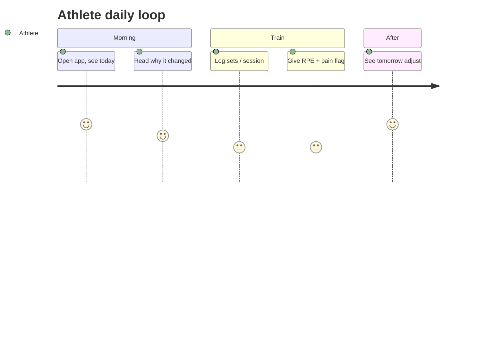

# PolySync — User Journeys

> Status: AUTHORED · Owner: Ossama Mokhtar

## 1. Jobs to be done

| Actor | JTBD |
|---|---|
| Hybrid athlete | When I'm training for a race *and* trying to keep my lifts, I want a plan that decides the trade-off for me each week, so I stop guessing and stop losing both. |
| Coach | When my roster grows past what I can hold in my head, I want the system to tell me which five athletes need me this week, so I can scale without becoming negligent. |
| Org | When I sell coaching, I want measurable adherence and retention across the roster, so I can prove the programme's value at renewal. |

The coach's JTBD is the one that closes deals in a B2B2C model. Build the console with the same care as the app.

## 2. Athlete daily loop

The retention moment is *seeing tomorrow change because of today*. If the plan looks static after a hard session, the product is indistinguishable from a PDF.

## 3. Coach weekly loop

Attention queue (escalation-sorted) → review proposed deltas → approve / amend / reject → amendments feed the eval set as labelled data. Coach amendments are the highest-value training signal in the system; instrument them from day one.

## 4. Failure states

| Failure | What the athlete sees | Recovery | Owner |
|---|---|---|---|
| Wearable gap > 72 h | Self-report readiness prompt | Degrade gracefully, no guessing | System |
| Pain flagged | "We've asked your coach to look at this. Here's a session that avoids it." | Human, within SLA | Coach |
| Missed 3+ sessions | Re-entry protocol, not a guilt message | Engine re-plan | Engine |
| Athlete overrides plan repeatedly | Ask why once; if pattern persists, surface to coach | Coach conversation | Coach |
| Model unavailable | Plan shows, rationale hidden with honest copy | Auto | System |
| Conflicting goals (race + PR in same block) | Explicit trade-off screen — the athlete chooses the priority | Product decision, not a silent one | Product |

The last row is the product. A hybrid-athlete tool that hides the trade-off is lying to the user; one that surfaces it is the reason they'd switch.

## 5. Trust moments

Onboarding (why do you need my injury history), first adaptation (was it right), first escalation (did a human really appear), first deload (why am I doing less). Instrument all four as funnel steps.
