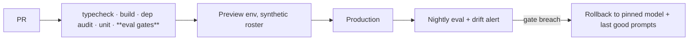

# PolySync — Security and Deployment

> Status: PROPOSED · Owner: Ossama Mokhtar

## 1. Threat model

| Threat | Vector | Control | Residual |
|---|---|---|---|
| Cross-tenant leakage | Roster query missing org scope | Tenancy at gateway + row-level policy + a test that asserts every query is scoped | Low |
| Prompt injection | Coach free-text notes, athlete messages, wearable device names | Untrusted-content fencing; classifier on retrieved text; **prescription path is deterministic so injection cannot change load** | Medium — measured, see doc 07 |
| Health data exfiltration | Model output echoing another athlete's data | Context assembled per-athlete only; no cross-athlete retrieval; output scanned for foreign IDs | Low |
| Cost attack | Conversation endpoint abuse | Per-athlete token budget, degrade to templated responses | Low |
| Coach account compromise | Approves malicious deltas at scale | Bounds checker applies to coach actions too; bulk-approval rate limit | Medium |
| Model regression | Provider silently updates | Pinned versions + nightly eval run + alert on gate drift | Medium |

Note row 2: the architecture decision in doc 01 is also the primary injection control. That is the strongest security argument in this repo — make it in interviews.

## 2. Secrets

Provider keys server-side only; never in the app bundle. Rotation TBD. Wearable OAuth tokens encrypted at rest, per-athlete revocable — revocation must actually delete, not flag.

## 3. Pipeline

Prompts and model versions are deployed artefacts under version control, not config edited in a console. A prompt change is a code change.

## 4. Rollback

Trigger: any hard-block gate breach, or coach-agreement drop > 5 pts. Mechanism: revert to pinned model + prompt bundle; the deterministic engine is unaffected, so athletes keep training through a rollback. Time to restore: TBD. Decision owner: TBD — name a person.

## 5. Compliance posture

Special-category data under GDPR Art. 9 / UAE PDPL. Explicit athlete consent, withdrawable, athlete-not-org as data subject. Data residency per org contract — TBD which regions you can actually serve today. **Not yet met:** formal DPIA, sub-processor register, retention automation. State this honestly in the repo; an org buyer's security questionnaire will find it anyway, and admitting it first is worth more than hiding it.
