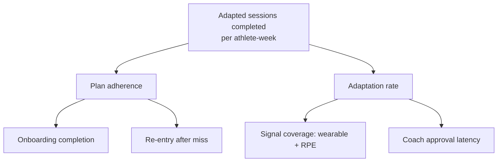

# PolySync — Metrics and Unit Economics

> Status: PROPOSED (framework) · TBD (all values) · Owner: Ossama Mokhtar

## 1. North star

> **Adapted sessions completed per athlete per week.**

Chosen because it is the only metric that requires all three parts of the product to work: the plan was delivered (engine), it changed in response to the athlete (AI), and the athlete did it (value). Sessions completed alone rewards a static PDF. Engagement alone rewards a chatbot.

## 2. Metric tree

## 3. Three funnels, not one

B2B2C means measuring all three or being surprised at renewal:

| Level | Activation | Retention | Leading indicator of churn |
|---|---|---|---|
| Athlete | First adapted week completed | Weekly active training | 2 consecutive missed weeks |
| Coach | First 20-athlete triage under 20 min | Weekly console use | Approval latency rising |
| Org | 60% roster activated in 30 d | Contract renewal | Roster activation flat at 90 d |

**Coach retention is the one most teams forget to instrument and the one that kills B2B2C deals.** A disengaged coach quietly stops approving, escalations queue, athletes lose trust, and the org sees flat outcomes at renewal. Watch approval latency as a churn predictor before you watch athlete DAU.

## 4. Guardrails

| Guardrail | Threshold | Action on breach |
|---|---|---|
| Safety escalation recall | ≥ 0.99 | Block release |
| Load-bound violations | 0 | Halt, incident |
| Coach minutes / athlete-month | ≤ TBD | Tighten escalation precision — never lower recall |
| Cost / successful athlete-week | ≤ TBD | Route more traffic to small model |

## 5. Unit economics — the decisive number

| Line | Value | Basis |
|---|---|---|
| Inference cost / athlete-month | TBD | Doc 04 |
| **Coach minutes / athlete-month** | TBD | Escalations × review time + weekly triage |
| Coach cost / athlete-month | TBD | Minutes × loaded rate |
| Infra / athlete-month | TBD | |
| **Total COGS / athlete-month** | TBD | |
| Price / athlete-month (org) | TBD | Both USD and AED |
| **Gross margin** | TBD | |

**The honest read:** ADR-003 makes coach minutes, not tokens, your dominant variable cost. Inference will trend to near-zero; coach time will not. So the defining engineering objective is not "cheaper model" — it is *reducing coach minutes per athlete while holding escalation recall at 0.99*. Every point of escalation precision you gain converts directly into gross margin.

Model the sensitivity explicitly: at 60 athletes per coach the business looks like software; at 20 it looks like an agency with a nice app. Know which one you're in before you price, and put the curve in your investor deck.
