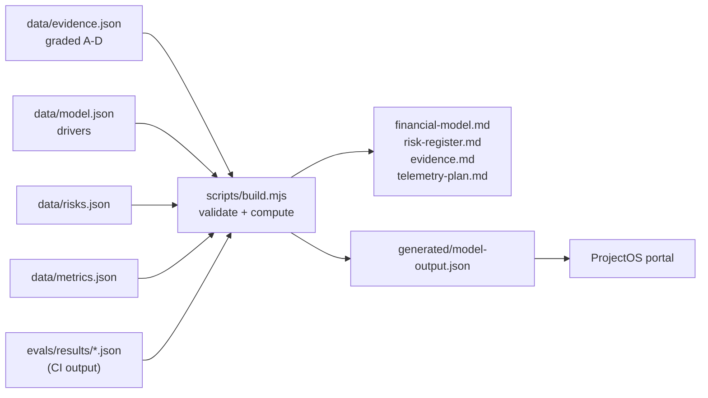

# PolySync product layer

> Status: AUTHORED · Updated 2026-09-24 · Owner: Ossama Mokhtar

The engineering docs in [`docs/`](../docs/README.md) say how PolySync works. This folder says whether it should exist, for whom, at what price, and what has to be measured next. Numbers here come from data files that CI validates, not from prose.

| Doc | What it answers |
|---|---|
| [Strategy](strategy.md) | Problem, customer, positioning, moat, pricing, go-to-market, non-goals |
| [Case study](case-study.md) | Decisions, trade-offs, measured results, what I would kill |
| [Financial model](financial-model.md) | Unit economics by market and schedule segment; sensitivity; required penetration |
| [Pilot plan](pilot-plan.md) | UAE, 3 clubs, 8 weeks; pass bars set before any data |
| [Risk register](risk-register.md) | 15 risks, each mitigation tied to a test, gate or decision, or marked unmitigated |
| [Telemetry plan](telemetry-plan.md) | North star, inputs, guardrails, events; which event replaces which model hypothesis |
| [Evidence register](evidence.md) | Every external claim, graded A–D, with the page it came from |
| [ProjectOS](https://ossamamokhtar.github.io/PolySync/) | Interactive portal: runs the real engine in the browser; dashboards read the same data |

## How the numbers stay honest

The build **fails** if any of these is true:

- A model driver has no evidence, recorded decision or measuring event.
- A driver uses D-grade evidence.
- A risk's control evidence points to a file that does not exist.
- The evidence file's eval numbers differ from CI's results.
- A generated doc is stale.

Run `node product/scripts/build.mjs` to regenerate; CI runs it with `--check`.
