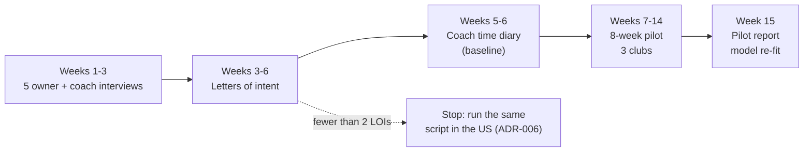

# PolySync pilot plan: UAE, 3 clubs, 8 weeks

> Status: AUTHORED · Updated 2026-09-24 · Owner: Ossama Mokhtar

**The pilot answers one question: will UAE HYROX clubs pay for coach capacity, and does PolySync deliver it with the coach time the model assumes?** Every pass bar below is set before any data exists, so the result cannot be argued into a win afterwards.

## What must be true before athlete one

| Blocker | Why | Gap |
|---|---|---|
| Server data access on `firebase-admin` with verified uid | Without it no athlete data persists | GAPS #12 |
| DPIA under the UAE PDPL; legal view on the health-data carve-out and free-zone regimes | Physical-condition data is sensitive personal data (REG-001) | GAPS #6 |
| Athlete app calls the hybrid engine | Otherwise athletes see the older single-modality plan | GAPS #13 |
| At least one S&C coach has reviewed rules H1–H9 and their parameters | The rules are literature defaults, not signed | GAPS #4 |

## Phases

**Who to approach first.** UAE HYROX training clubs, including official HYROX Performance Centers (GymNation operates in four emirates, MKT-007) and boutique clubs that run HYROX prep classes (MKT-006). These are candidates only; none has been contacted.

**Who to recruit inside each club.** 10–20 athletes per club, **flexible segment first**: 6–7 available days, doubles acceptable (ADR-008). Adults only; not a clinical population.

## Pass bars (set 2026-09-24, before any data)

| # | Measure | Pass | Source of the bar | Fails means |
|---|---|---|---|---|
| 1 | Club owners signing a paid-pilot LOI | ≥ 2 of 5 at ≥ $5 (AED 18) per athlete-month | Model price range low end | Stop; ADR-006 reversal trigger |
| 2 | Coach minutes per athlete-week programming by hand (diary baseline) | ≥ 8 | Model low end; below this the UAE cost case is negative | Sell capacity only, or move to the US |
| 3 | Coach minutes per athlete-month with PolySync | ≤ 23 | 1.5 × modelled standard segment (15.4) | Tighten escalation precision before scaling |
| 4 | Escalation rate by schedule segment | Within 2× of the simulation | ADR-008 reversal trigger | Re-fit the model to observed rates |
| 5 | Contraindicated exercises reaching an athlete | 0 | Safety guardrail | Stop the pilot |
| 6 | Pain flags escalated to a coach | 100%, reviewed within 24 h | Safety guardrail | Stop the pilot |
| 7 | Prescribed sessions completed | ≥ 70% | Target, not evidence | Investigate plan fit before growth |
| 8 | Clubs continuing on paid terms after week 8 | ≥ 2 of 3 | Commercial proof | The value is not landing |

## What the pilot replaces in the model

Each hypothesis driver in the [financial model](financial-model.md) names the event or study that measures it (see the [telemetry plan](telemetry-plan.md)). After week 15 the five drivers that swing club ROI most (by the model's sensitivity table) become evidence:

1. Coach minutes by hand
2. Specialist wage premium
3. Price
4. Minutes per escalation
5. Coach on-cost

## Consent and data

- Explicit consent at onboarding, naming each data type.
- Athletes can export and delete their data ([ownership decision](../docs/02-data-ownership-decision.md)).
- No data leaves the pilot for model training.
- Coach notes stay with the club.
- PolySync makes no injury-prevention or performance claims to pilot athletes (ADR-007).

## Cost

- **Inference:** about $0.20 per athlete-month at list price (CST-003), so under $30 for 3 clubs × 20 athletes × 8 weeks.
- **Main cost:** founder time and legal review for the DPIA.
