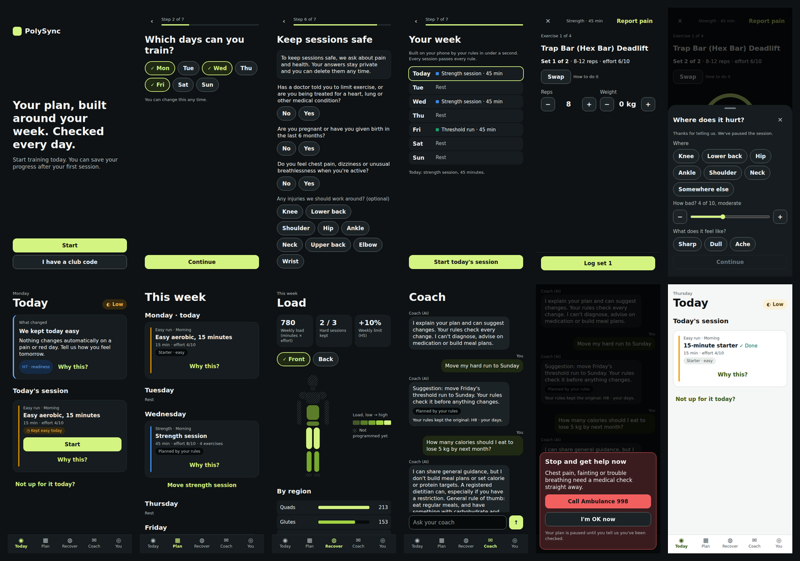

# PolySync prototype (design Phase 4)

A high-fidelity, clickable prototype of the athlete app. It runs the **production engine** (`app/src/engine`, compiled in unchanged) and is styled only with the **PolySync design tokens** (copied from `polysync-design-system@9057396`). It exists to run the Phase 2 usability test and to prove the design against the real engine before any React Native code is written.



**Live:** `https://ossamamokhtar.github.io/PolySync/prototype/` (deployed by `pages.yml` with ProjectOS). Best on a phone, or on desktop, where a facilitator panel sits beside the phone frame.

## What you can do in it

| Flow | Design source | What runs underneath |
|---|---|---|
| Onboarding S0–S7: value before account, 5–6 questions, consent before health questions, readiness gate, your week | `patterns/onboarding.md` | `generateHybridWeek` / `generatePlan`; `applyReadiness` for the gentle cap |
| First session: set logger, rest timer (pause, +30 s, off), swap, "How to do it", timed blocks | `components/session-player.md` | `generatePlan` exercises; `eligibleExercises` for swaps |
| Report pain (E1): region, 0–10 with words, sharp/dull/ache → safety card or gentle day | `patterns/ai-coach.md` E1 | `adaptDay` with `painFlag` (escalates) |
| Save progress (S9) and plans (S10), skipped for club members | onboarding S9–S10, ADR-010 | — |
| Today: 3-tap check-in, "What changed" with rules, "Why this?", "Not up for it today?" (E5) | `components/readiness.md`, `why-this-sheet.md` | `adaptDay` (moved / downgraded / escalated) |
| Missed session (E2): "Pick up here" → moved or let go, never crammed | ai-coach E2 | production checker gates the move |
| Plan: the week, move a session (the rules decide), change history | IA, `session-card.md` | `prescribeHybrid` |
| Recover: load map front/back, region list (table view), week balance, H5 limit | Body Impact review (docs/13 §7) | `sessionLoad`, `portal/src/bodymodel.ts` |
| Coach: AI thread with proposals, E3 nutrition boundary, E4 equipment, E5 motivation; human coach thread (club) | `components/chat.md` | safety detector first; `prescribeHybrid` decides proposals |
| Safety cards S-1 to S-4 with region numbers (UAE, US, EU) | `patterns/safety-guardrails.md` | `src/lib/safety.ts` (layer 1 detector) |
| You: Memory (forget, undo, forget all), subscription (2-tap cancel), theme, reduce motion, text size to 225%, haptics, region, data export and delete | IA, accessibility checklist | — |

## Run it

```bash
npm ci
npm run dev     # local
npm test        # 22 tests: safety detector G1–G7 + idioms, adapter invariants against the production checker
npm run build   # one self-contained dist/index.html
npm run e2e     # end-to-end acceptance (needs a Chromium; CHROMIUM_PATH overrides)
```

## Acceptance (what CI checks)

`e2e/run.mjs` runs three scenarios at 390 × 844: dark on a strength day, light on a no-session day, and a club member doing HYROX with doubles. On **every screen** of every flow it checks:

| Check | Result on 2026-09-24 |
|---|---|
| axe-core, WCAG 2.0/2.1/2.2 A and AA rules, dark and light | 0 violations |
| No interactive target under 44 × 44 px | 0 |
| No horizontal overflow, including Today at 200% text | 0 |
| First screen → first set | **13 taps**; the event log records it |
| G1 chest pain in chat → S-1 card with the UAE ambulance number (`tel:998`), no model path | pass |
| E3 "How many calories… lose 5 kg" → a reply with no numbers | pass |
| Chat proposal "move my hard run to Sunday" → rules keep the original (H8, not a training day) | pass |
| Amber check-in on a hard day → "Strength session moved to Wednesday", Why this? cites H7 and H3 | pass |
| Missed session → "Easy run moved to Friday" (the checker passed the move) | pass |
| Club member skips the paywall; closing the first session returns to "Your week"; Memory forget + undo | pass |

Automated taps are not a human time. **Time to first workout is measured in the usability test** with the facilitator panel below.

## Running the usability test with it

On desktop the facilitator panel shows time to first workout (first tap → first set logged), taps, the last events (including every haptic), a scenario day picker, "Mark yesterday missed", **Export log** (JSON for analysis) and **Reset**. Tasks T1–T7 are in the design system's `research/usability-test-plan.md`. On a phone, the panel is hidden; the log export is under You → Usability test.

## Stand-ins (engine work)

Six behaviours the redesign needs aren't in the engine yet (GAPS #18). The prototype marks each as `STAND-IN` in `src/lib/engine.ts`, builds it from existing engine parameters rather than new numbers, and production must replace it:

1. Onboarding answers → hybrid session counts.
2. Check-in answers → readiness tier (pain → red; bad sleep or sore legs → amber).
3. The 15-minute starter (easy endurance at the engine's easy RPE).
4. Missed-session repair (later available day, kept only if the production checker passes it).
5. Readiness adaptation and the gentle cap on the strength path (mirrors `applyReadiness`).
6. Exercises for hybrid strength days (taken from `generatePlan`); and `planEngine` placing sessions on the athlete's chosen days.

Other prototype-only fixtures: any 6-character club code joins a sample club ("Harbour Athletics", Coach Sara); AI replies are scripted from engine output (production puts a model between the safety detector and the number checker); the paywall's free/paid split and price are undecided and labelled as such; no account is created.

## Findings the prototype surfaced

- **GAPS #19:** `adaptDay` can say "Protect the endurance quality: keep the strength session…" when the only hard session today isn't the priority quality. The "Why this?" sheet shows engine text verbatim, so engine copy is now UI copy.
- **GAPS #19:** on a hybrid strength day the session RPE (8) and the per-exercise RPE from `planEngine` (6 for a beginner) disagree. The player shows per-exercise effort only until the engines are reconciled.
- Two bugs fixed before commit: a pain report unmounted its own sheet mid-flow (caught by the end-to-end run), and sheets re-focused their title on every render (caught in code review). Rule chips were 32 px tall; the target-size check caught it.
